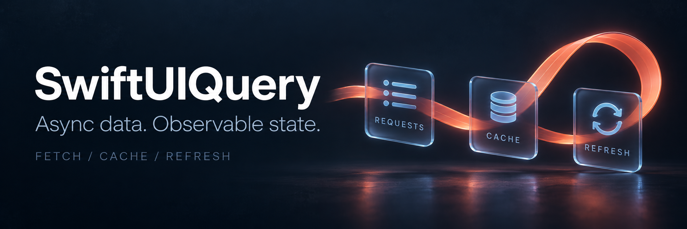

<div align="center">



# SwiftUIQuery

**A small query layer for Swift concurrency, SwiftUI, and UIKit.**

Share query state across views, collect unused cache entries, and manage mutations with optimistic updates.

[](Package.swift)
[](Package.swift)
[](#installation)
[](LICENSE)
[](https://github.com/snndmnsz/SwiftUIQuery/releases/tag/0.1.1)

[Getting started](Documentation/GettingStarted.md) · [SwiftUI guide](Documentation/SwiftUI.md) · [UIKit guide](Documentation/UIKit.md) · [API reference](Documentation/API.md) · [Examples](Examples) · [Changelog](CHANGELOG.md)

</div>

---

## Less bookkeeping around every fetch

You provide an async operation. SwiftUIQuery handles reusable in-memory results, retry policies, and observable query state. Keep your existing networking service: the package has no knowledge of URLs, authentication, or decoding.

```swift
import SwiftUIQuery

// Post and api belong to your app. Post must conform to Sendable.
let posts: [Post] = try await QueryClient.shared.fetch(
    key: "posts",
    staleTime: .minutes(5),
    gcTime: .minutes(10)
) {
    try await api.posts()
}
```

A subsequent fetch for the same key can reuse the cached value. Use `refetch(key:)` to bypass a fresh cached value, or `invalidate(_:)` to mark data stale and refresh active queries.

## What you get

| Capability | What it does |
| --- | --- |
| Async query coordination | Execute any `@Sendable` async throwing closure. |
| Cache lifetimes | Separate data freshness (`staleTime`) from unused-record collection (`gcTime`). |
| Shared in-flight work | Same-key requests can await the same tracked operation. |
| Shared observable state | Same-key views update together through Observation or Combine. |
| Retry policies | Configure additional attempts, delays, and optional exponential backoff. |
| Prefetch and refresh | Warm the cache or rerun a registered operation. |
| Parameter changes | Keep previous data while switching to a new query key. |
| Periodic refresh | Force a refresh on each tick, tied to your view task. |
| Mutations | Track writes, pending/error state, and async reconciliation callbacks. |
| Optimistic updates | Update cached data immediately with conditional rollback on failure. |
| Cancellation | Cancel shared work explicitly or detach individual consumers safely. |

Zero third-party dependencies. Built with Swift actors, Observation, and Combine.

## Installation

**Requirements:** Swift 6.0 or later, iOS 15+ or macOS 14+.

In Xcode, choose **File → Add Package Dependencies**, then enter:

```text
https://github.com/snndmnsz/SwiftUIQuery.git
```

Select the `SwiftUIQuery` product and add it to your app target.

For another Swift package:

```swift
// In Package.swift:
dependencies: [
    .package(
        url: "https://github.com/snndmnsz/SwiftUIQuery.git",
        .upToNextMinor(from: "0.1.1")
    )
],
targets: [
    .target(
        name: "YourApp",
        dependencies: [
            .product(name: "SwiftUIQuery", package: "SwiftUIQuery")
        ]
    )
]
```

The package is currently **0.x**. API changes may occur between minor versions; use an up-to-next-minor requirement when you want patch updates only.

## Use it with SwiftUI

Choose the adapter for your deployment target. Both provide the same query methods and state, backed by a shared implementation.

| Deployment target | Result type | SwiftUI ownership |
| --- | --- | --- |
| iOS 15+ / macOS 14+ | `ObservableQueryResult<Value>` | `@StateObject` (Combine) |
| iOS 17+ / macOS 14+ | `QueryResult<Value>` | `@State` (Observation) |

For an app supporting iOS 15, use `ObservableQueryResult` on every supported OS version; no runtime branching is required. Existing iOS 17+ code continues to work.

This example assumes your app provides a `Sendable`, `Identifiable` `Post` model and a concurrency-safe `api` service.

```swift
@MainActor
struct PostsView: View {
    @StateObject private var query: ObservableQueryResult<[Post]>

    init() {
        _query = StateObject(wrappedValue: ObservableQueryResult(key: "posts") {
            try await api.posts()
        })
    }

    var body: some View {
        List(query.data ?? []) { post in
            Text(post.title)
        }
        .overlay {
            if query.isLoading {
                ProgressView()
            }
        }
        .safeAreaInset(edge: .bottom) {
            if let error = query.error {
                Text(error.localizedDescription)
                    .foregroundStyle(.red)
                    .padding()
            }
        }
        .task { await query.run() }
        .refreshable { await query.refetch() }
    }
}
```

Add `import SwiftUI` and `import SwiftUIQuery` in your view file. See the [iOS 15 catalog example](Examples/CatalogView15.swift) and its [shared demo service](Examples/CatalogView.swift) for a view you can copy into an app without an API server.

## Use it with UIKit

On iOS 15+, store `ObservableQueryResult` and `ObservableMutationResult` in your view controller or view model and subscribe to `$state` with Combine. The existing adapters support UIKit directly and share the same cache with SwiftUI screens.

Start queries with `startPeriodicRefetch()` when the screen appears and call `stopObserving()` when it disappears. Keep subscriptions alive and use weak controller captures. See the [UIKit guide](Documentation/UIKit.md) and [self-contained catalog controller](Examples/CatalogViewController.swift) for loading, errors, pull-to-refresh, and lifecycle cleanup.

## A few useful operations

```swift
// Rerun the last operation registered for this key.
let freshPosts: [Post] = try await QueryClient.shared.refetch(key: "posts")

// Mark stale, refresh active queries, and update subscribed views.
await QueryClient.shared.invalidate("posts")

// Forget both the cached value and the registered closure.
await QueryClient.shared.remove("posts")
```

Each key should identify **one result type and one logical query**. Include inputs such as account ID, filters, and page number in the key.

## Mutations without repeated boilerplate

```swift
// EditProfile, Profile, service, and client belong to your app.
let save = ObservableMutationResult<EditProfile, Profile>(
    operation: { try await service.saveProfile($0) },
    onSuccess: { profile, _ in
        try? await client.setQueryData(key: "profile", data: profile)
    },
    onSettled: { _ in await client.invalidate(prefix: "profile/") }
)

let saved = try await save.mutate(edit)
```

Read `save.isPending` and `save.error` in your view. Writes are never cached, deduplicated, or automatically retried. See the [mutation guide](Documentation/Mutations.md) for optimistic updates and the [self-contained iOS 15 favorite example](Examples/FavoriteView15.swift).

## Understand the boundaries

SwiftUIQuery uses a memory-only cache with automatic collection of inactive records. It does not include persistence, infinite-query orchestration, or automatic foreground/reconnection refresh.

Swift cancellation is cooperative; operations that ignore it may continue, but cannot restore superseded query state. Optimistic rollback protects newer writes and does not merge concurrent edits. Read [behavior and limitations](Documentation/Behavior.md).

## Documentation

- [Mutations and optimistic updates](Documentation/Mutations.md) — writes, callbacks, rollback, and concurrency.
- [iOS compatibility](Documentation/iOS15.md) — adapter choice and compatibility guarantees.
- [Getting started](Documentation/GettingStarted.md) — installation, requirements, first query, and testing.
- [Query behavior](Documentation/Behavior.md) — caching, identity, retries, refresh, and cancellation.
- [SwiftUI integration](Documentation/SwiftUI.md) — state ownership, parameter changes, and polling.
- [UIKit integration](Documentation/UIKit.md) — Combine binding, controller lifetime, and mutations.
- [API reference](Documentation/API.md) — public types, methods, options, and defaults.
- [Recipes](Documentation/Recipes.md) — prefetching, account isolation, logging, and previews.
- [Contributing](CONTRIBUTING.md) — local validation and release workflow.

## Development

```sh
swift build
swift test
./Scripts/check-examples.sh
./Scripts/check-ios15.sh
```

GitHub Actions runs package tests, checks SwiftUI examples on macOS, compiles the library and all SwiftUI/UIKit examples at an iOS 15 deployment target, and builds for iOS Simulator. See [CI](https://github.com/snndmnsz/SwiftUIQuery/actions/workflows/ci.yml).

## License

SwiftUIQuery is available under the [MIT License](LICENSE).
